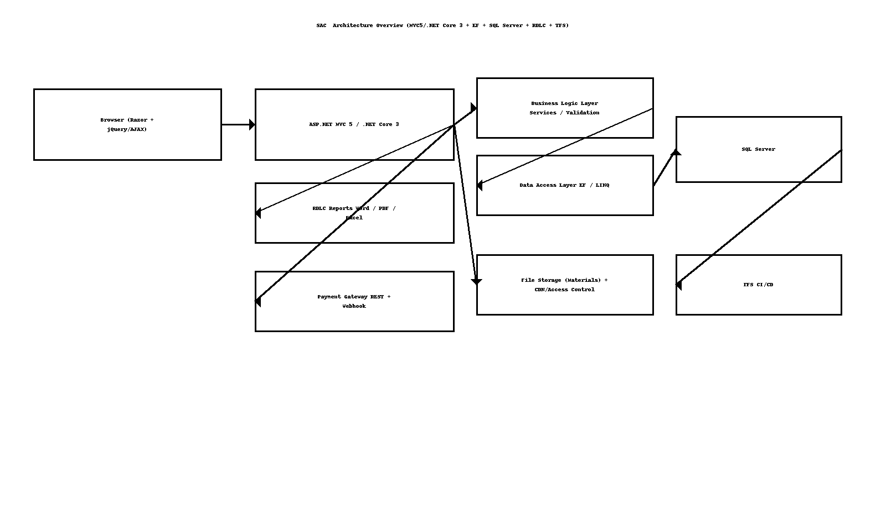

# Sudarshan Agrawal Classes — High-Level Design (HLD)

> **Author:** Sagarika Chakraborty — Full Stack .NET Engineer | React.js | Web API | SQL Server

## 1) Overview & Scope
A web portal for **student lifecycle** (registration → enrollment → payment → learning assets). It offers:
- **Student registration & profiles**, course/batch mapping, fee plan allocation.
- **Secure online fee payments** via payment gateway (REST + webhooks).
- **Study material distribution** with access control and tracking.
- **Reporting** (Word/PDF/Excel) via RDLC.
- Admin console for course/batch/material/fees management.

## 2) Quality Attributes (NFRs)
- **Security**: AuthN/Z, HTTPS, CSRF protection; rate limits on payment & downloads.
- **Performance**: Paging/caching for listings; optimized EF/LINQ queries.
- **Reliability**: Transactional fee posting; idempotent webhook handling.
- **Scalability**: Stateless controllers; DB indexes; optional CDN for files.
- **Maintainability**: 3-layer design with clear separation (BLL/DAL/Models).
- **Observability**: Structured logs, audit trails for fee and material events.

## 3) Architecture


```mermaid
flowchart LR
  A[Browser (Razor + jQuery/AJAX)] --> B[ASP.NET MVC 5 / .NET Core 3 Controllers]
  B --> C[BLL (Services, Validation)]
  C --> D[DAL (EF Repos, LINQ)]
  D --> E[(SQL Server)]
  B --> F[RDLC Reports]
  B --> G[Payment Gateway (REST/Webhook)]
  B --> H[File Storage (Materials) + CDN]
  B --> I[TFS CI/CD]
```

## 4) Core Modules
- **Students**: Registration, profile, guardians, KYC docs.
- **Fees**: Plans, dues, online payments, receipts, refunds.
- **Materials**: Uploads, tagging (course/batch), downloads, versioning.
- **Reports**: Finance (collections/dues), academics (utilization, downloads), invoices.
- **Admin**: Courses, batches, users/roles, permissions.

## 5) Key Flows
1. **Register Student** → validate → persist → assign fee plan & batch.
2. **Pay Fees** → initiate payment → gateway callback (webhook) → update ledger & receipt.
3. **Access Materials** → authorize via course/batch → log download → update metrics.
4. **Reports** → run RDLC report → export to PDF/Word/Excel.

## 6) Security & Compliance
- ASP.NET Identity (or forms auth) with role/claim checks.
- Anti-forgery tokens; server-side validation; file type/size limits.
- PCI-DSS alignment via offsite payment provider (no card storage).

## 7) Availability & DR
- DB backups/PITR; scripted restores.
- Blue/green or staged deployments via TFS; config transforms per environment.

## 8) CI/CD
- TFS pipelines: restore → build → test → package → deploy.
- Environment variables & secrets managed per environment.
