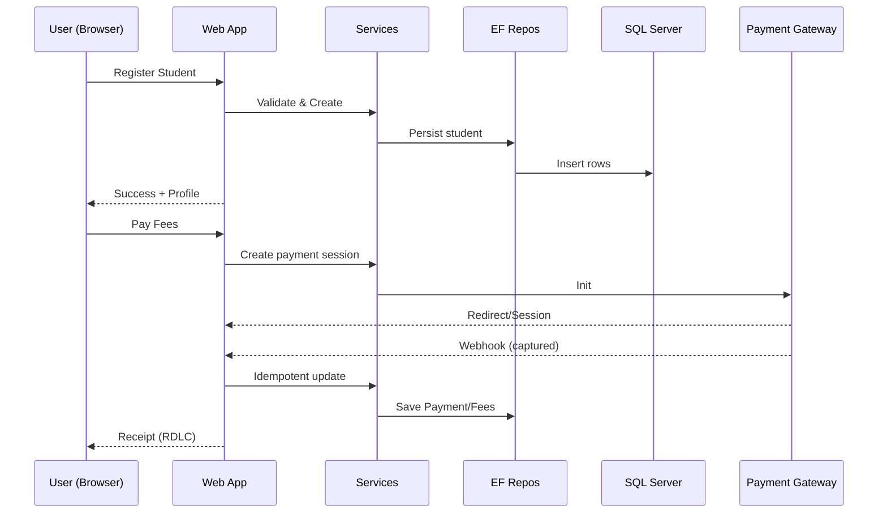

# Sudarshan Agrawal Classes — Low-Level Design (LLD)

> **Author:** Sagarika Chakraborty — Full Stack .NET Engineer | React.js | Web API | SQL Server

## 1) Solution Layout (3-Layer)
- **SAC.Web** — MVC 5 / .NET Core 3 Web (Controllers, Views, Filters, Bundles)
- **SAC.BLL** — Services (Students, Fees, Materials, Reports), Validators, Mappers
- **SAC.DAL** — EF DbContext, Repositories, Migrations/SQL Scripts
- **SAC.Models** — Entities, DTOs/ViewModels
- **Reports/** — RDLC templates (Finance, Invoices, Academic)
- **Tests/** — Unit tests for services and repositories

## 2) Controllers & Actions (samples)
### StudentsController
- `Register()` GET/POST — student onboarding
- `Profile(id)` — view/update profile
- `AssignBatch(id)` — map to course/batch

### FeesController
- `Plans()` — list/assign plans
- `Pay(id)` — create payment session
- `Webhook()` — gateway callback (idempotent)
- `Receipt(id)` — render invoice (RDLC)

### MaterialsController
- `Upload()` — staff upload (course/batch/tagging)
- `List(courseId, batchId)` — download list
- `Download(id)` — authorized download + tracking

### ReportsController
- `Finance()` — collections/dues
- `Academic()` — material usage

## 3) DTOs (examples)
```json
// StudentRegisterRequest
{
  "name": "Asha Verma",
  "email": "asha@example.com",
  "phone": "+91-90000-00000",
  "courseId": 12,
  "batchId": 45
}

// PaymentWebhook (simplified)
{
  "orderId": "INV-2025-00123",
  "status": "captured",
  "amount": 15000
}
```

## 4) Validation & Rules
- Unique email/phone; valid course/batch mapping.
- Fee plan must exist; prevent duplicate payment capture (idempotency key).
- Materials: enforce file type/size; virus-scan hook (optional).

## 5) Persistence (ER Overview)
**Tables**
- `Students(id, name, email, phone, guardianName, courseId, batchId, createdAt)`
- `Courses(id, name, description)`
- `Batches(id, courseId, name, startDate, endDate)`
- `Fees(id, studentId, planId, amount, status, dueDate, paidAt, receiptNo)`
- `Materials(id, courseId, batchId, title, url, version, uploadedBy, uploadedAt)`
- `Downloads(id, materialId, studentId, at)`
- `Payments(id, studentId, orderId, provider, txnId, status, amount, at)`

Indexes: `Students(courseId, batchId)`, `Materials(courseId, batchId)`, `Payments(orderId) unique`.

## 6) Sequences


## 7) Error Handling
- `400` validation; field-level messages for AJAX
- `401/403` auth failures
- `404` resource not found
- `409` duplicate capture/invalid state
- `5xx` generic failure with correlation id

## 8) Performance
- EF Include/ThenInclude; indexes for hot queries
- Output caching for catalogue-like pages
- Async file streaming for downloads

## 9) CI/CD (TFS)
- Build → test → package → deploy per environment
- Config transforms; DB migrations
- Rollback playbook and backup policy

## 10) Reports
- RDLC templates: **Invoices**, **Collections**, **Academic Usage** with export to **Word/PDF/Excel**.
